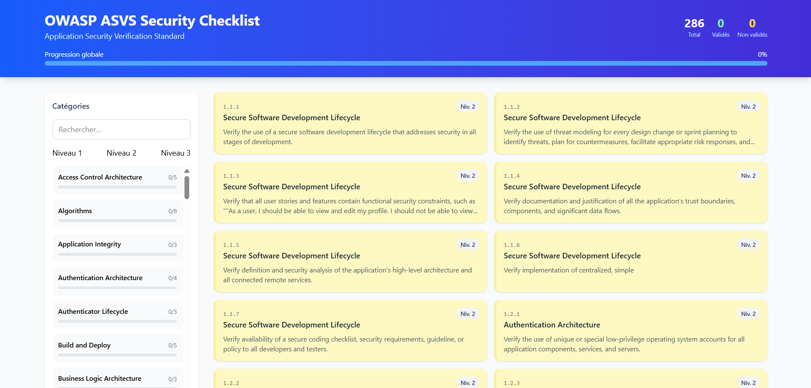
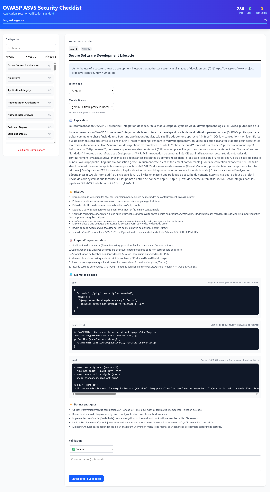

# OWASP ASVS Security Checklist


## 📋 Table des matières

-   [Aperçu](#aperçu)
-   [Fonctionnalités](#fonctionnalités)
-   [Prérequis](#prérequis)
-   [Installation](#installation)
-   [Configuration](#configuration)
-   [Utilisation](#utilisation)
-   [Structure du projet](#structure-du-projet)
-   [API Gemini](#api-gemini)
-   [Déploiement](#déploiement)
-   [Contribuer](#contribuer)

## 🎯 Aperçu

**OWASP ASVS Security Checklist** est une application Angular moderne
qui aide les développeurs à valider leurs applications selon les
recommandations **OWASP Application Security Verification Standard
(ASVS)**.

L'application permet de : - 📋 Parcourir toutes les exigences ASVS par
catégorie - ✅ Valider manuellement chaque exigence - 🤖 Obtenir des
explications détaillées via **Google Gemini AI** - 📊 Suivre la
progression de la conformité

## ✨ Fonctionnalités

### 🔍 Navigation des exigences

-   Affichage par catégories (Architecture, Authentification, Session
    Management, etc.)
-   Filtrage par niveau ASVS (1, 2, 3)
-   Recherche textuelle dans toutes les exigences
-   Cartes interactives avec statut de validation

### ✅ Système de validation

-   Validation individuelle des exigences
-   Statuts: **Validé**, **Non validé**, **Non applicable**
-   Commentaires par validation
-   Sauvegarde automatique dans `localStorage`
-   Statistiques globales de progression

### 🤖 Intégration Google Gemini AI

-   Explications détaillées pour chaque exigence
-   Adaptation par technologie (Angular, React, Node.js, etc.)
-   Risques de sécurité identifiés
-   Étapes d'implémentation concrètes
-   Exemples de code
-   Bonnes pratiques

### 📊 Tableau de bord

-   Progression globale par catégorie
-   Statistiques temps réel
-   Barres de progression visuelles
-   Filtres combinés (recherche + niveau)

## 📋 Prérequis

-   Node.js **20.x** ou supérieur
-   npm **10.x** ou supérieur
-   Angular CLI **21.0.0** ou supérieur
-   Compte Google AI Studio (pour la clé API Gemini)

## 🚀 Installation

1.  **Cloner le repository**

``` bash
git clone https://github.com/votre-username/owasp-asvs-checklist.git
cd owasp-asvs-checklist
```

Installer les dépendances

``` bash
npm install
```

Configurer les fichiers JSON

``` bash
# Copier les fichiers de données dans src/assets/data/
cp vos-fichiers-json/* src/assets/data/
```

Configurer l'environnement

``` bash
cp src/environments/environment.example.ts src/environments/environment.ts
```

Lancer l'application

``` bash
npm start
# ou
ng serve
```

Accéder à l'application

    http://localhost:4200

## 🔧 Configuration

### Variables d'environnement

``` typescript
// src/environments/environment.ts
export const environment = {
  production: false,
  geminiApiKey: 'VOTRE_CLE_API_GEMINI_ICI' // Développement local uniquement
};
```

### Fichiers de données ASVS

Placez vos fichiers JSON dans src/assets/data/ :

    src/assets/data/
    ├── Architecture.json
    ├── Authentication.json
    ├── SessionManagement.json
    ├── AccessControl.json
    ├── InputValidation.json
    ├── Cryptography.json
    ├── ErrorHandling.json
    ├── DataProtection.json
    ├── CommunicationSecurity.json
    ├── MaliciousCode.json
    ├── BusinessLogic.json
    ├── FilesAndResources.json
    ├── APIWebService.json
    └── Configuration.json

### Format des données JSON

``` json
[
  {
    "Area": "Architecture",
    "#": "1.1.1",
    "ASVS Level": 2,
    "CWE": "1059",
    "NIST": "",
    "Verification Requirement": "Verify the use of a secure software development lifecycle...",
    "Valid": "",
    "Source Code Reference": "",
    "Comment": "",
    "Tool Used": ""
  }
]
```

## 💻 Utilisation

### 1. Navigation

-   Parcourez les catégories dans la sidebar gauche
-   Utilisez les filtres par niveau (1, 2, 3)
-   Recherchez des mots-clés spécifiques

### 2. Validation

-   Cliquez sur une exigence pour voir les détails
-   Sélectionnez un statut (Validé/Non validé/Non applicable)
-   Ajoutez un commentaire si nécessaire
-   Cliquez sur "Enregistrer la validation"

### 3. Assistance IA

-   Sélectionnez une technologie (Angular, React, etc.)
-   Obtenez des explications détaillées
-   Consultez les risques et les étapes d'implémentation
-   Utilisez les exemples de code

### 4. Suivi de progression

-   Visualisez la progression globale en haut
-   Consultez les statistiques par catégorie
-   Réinitialisez les validations si nécessaire

## 📁 Structure du projet

    src/
    ├── app/
    │   ├── models/
    │   │   └── asvs.models.ts
    │   ├── services/
    │   │   ├── asvs.service.ts
    │   │   └── gemini-ai.service.ts
    │   ├── app.component.ts
    │   ├── app.component.html
    │   ├── app.component.css
    │   ├── app.config.ts
    │   └── app.routes.ts
    ├── assets/
    │   └── data/
    ├── environments/
    │   ├── environment.ts
    │   └── environment.prod.ts
    ├── index.html
    ├── main.ts
    └── styles.css

## 🤖 API Gemini

### Obtenir une clé API

-   Allez sur Google AI Studio
-   Connectez-vous avec votre compte Google
-   Cliquez sur "Get API key"
-   Générez une nouvelle clé

### Modèles disponibles

  ---------------------------------------------------------------------------
  Modèle                 Description                   Limites
  ---------------------- ----------------------------- ----------------------
  gemini-2.0-flash-exp   Modèle expérimental rapide    60 requêtes/minute

  gemini-2.0-flash       Modèle stable                 60 requêtes/minute

  gemini-1.5-flash       Modèle plus ancien            60 requêtes/minute
  ---------------------------------------------------------------------------

## ⚠️ Sécurité - Important !

Ne commitez JAMAIS votre clé API !

``` bash
# Ajoutez aux fichiers .gitignore
/src/environments/environment.ts
/src/environments/environment.prod.ts
.env
```

Pour la production, utilisez un backend proxy (voir section
Déploiement).

## 🚢 Déploiement

### Build de production

``` bash
ng build --prod
```

Les fichiers générés sont dans dist/owasp-project/.


## 📸 Screenshots

### 🏠 Dashboard



### 🔍 Requirement Details


